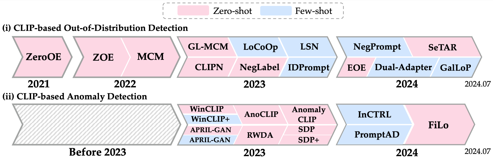
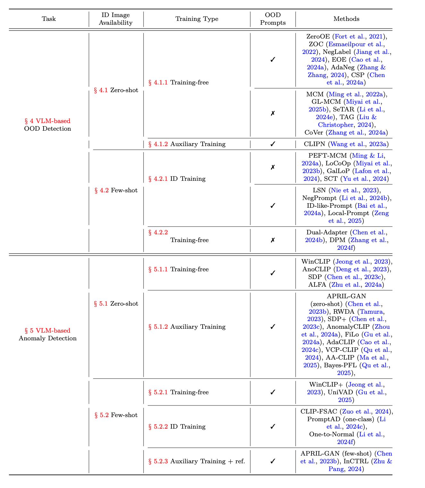
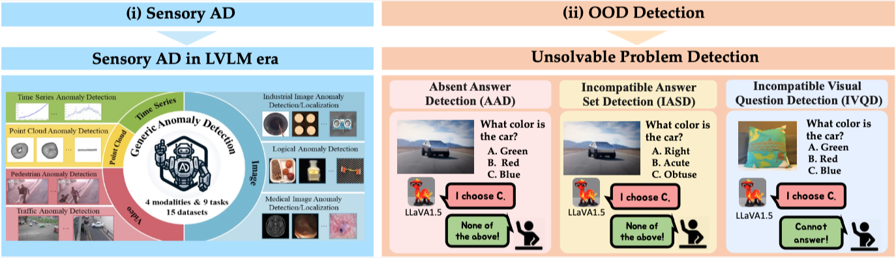

# Generalized Out-of-Distribution Detection and Beyond in Vision Language Model Era: A Survey
[](http://arxiv.org/abs/2407.21794)
&nbsp;&nbsp;&nbsp;
[](https://github.com/AtsuMiyai/Awesome-OOD-VLM/issues)
&nbsp;&nbsp;&nbsp;
[](https://openood.slack.com/)


## Generalized OOD Detection v2
|🚀 Our framework encapsulates the evolution of OOD detection and related tasks in the VLM era, fostering collaborative efforts among each community 🤝|
|-----------------------------------------|


<p align="center" width="100%">

<div>
<div align="center">
<br>
    <a href='https://atsumiyai.github.io/' target='_blank'>Atsuyuki Miyai<sup>1</sup></a>&emsp;
    <a href='https://jingkang50.github.io/' target='_blank'>Jingkang Yang<sup>2,†</sup></a>&emsp;
    <a href='https://zjysteven.github.io/' target='_blank'>Jingyang Zhang<sup>3</sup></a>&emsp;
    <a href='https://pages.cs.wisc.edu/~alvinming/' target='_blank'>Yifei Ming<sup>4</sup></a>&emsp;
    <a href='https://yueqianlin.com/' target='_blank'>Yueqian Lin<sup>3</sup></a>&emsp;
    <br>
    <a href='https://yu1ut.com/' target='_blank'>Qing Yu<sup>1,5</sup></a>&emsp;
    <a href='https://scholar.google.co.jp/citations?hl=ja&user=2bCSG1AAAAAJ&view_op=list_works&authuser=1&sortby=pubdate' target='_blank'>Go Irie<sup>6</sup></a>&emsp;
    <a href='https://raihanjoty.github.io/' target='_blank'>Shafiq Joty<sup>4,2</sup></a>&emsp;
	  <a href='https://pages.cs.wisc.edu/~sharonli/' target='_blank'>Yixuan Li<sup>7</sup></a>&emsp;
    <a href='https://ece.duke.edu/faculty/hai-helen-li' target='_blank'>Hai Li<sup>3</sup></a>&emsp;
	  <a href='https://liuziwei7.github.io/' target='_blank'>Ziwei Liu<sup>2,†</sup></a>
    <br>
    <a href='https://scholar.google.com/citations?user=rE9iY5MAAAAJ&hl=en' target='_blank'>Toshihiko Yamasaki<sup>1</sup></a>&emsp;
    <a href='https://scholar.google.co.jp/citations?user=CJRhhi0AAAAJ&hl=en' target='_blank'>Kiyoharu Aizawa<sup>1</sup></a>
</div>
<div align="center">
    <sup>1</sup>The University of Tokyo&emsp;
    <sup>†</sup>S-Lab, <sup>2</sup>Nanyang Technological University&emsp;
    <sup>3</sup>Duke University&emsp;
    <sup>4</sup>Salesforce AI Research&emsp;
    <sup>5</sup>LY Corporation&emsp;
    <sup>6</sup>Tokyo University of Science&emsp;
    <sup>7</sup>University of Wisconsin-Madison&emsp;&emsp;
    <br>
</div>


## About This Repository
This is a repository of our survey paper. We hope that our survey can help readers and participants better understand the demanding challenges on OOD detection and related topics in the VLM era.     
This repository plays the following two roles:
- This repository provides an easily accessible list of the references mentioned in the paper Table 2. This list will continue to include more promising works as new ones emerge. Please feel free to recommend relevant and good works via [Pull Request](https://github.com/AtsuMiyai/Awesome-OOD-VLM/pulls).
- We hope that this repository will become a discussion panel for readers to ask questions, raise concerns, and make constructive comments. Feel free to post your ideas to [Issues](https://github.com/AtsuMiyai/Awesome-OOD-VLM/issues).


## Abstract
We present a **generalized OOD detection v2**, encapsulating the evolution of Anomaly Detection (AD), Novelty Detection (ND), Open-set Recognition (OSR), Out-of-distribution (OOD)
detection, and Outlier Detection (OD) in the VLM era. Our framework reveals that, with some field inactivity and integration, **the demanding challenges in the
VLM era have become OOD detection and AD**. In addition to the inter-field evolution, we also highlight the significant shift in the definition,
problem settings, and benchmarks; our work thus features a comprehensive review of the methodology for OOD detection, including
in-depth discussion over other related tasks to clarify their relationship to and influence on OOD detection. Finally, we explore **the
advancements in the emerging Large Vision Language Model (LVLM) era**, represented by GPT-4V. We conclude this survey with open
challenges and potential research directions of OOD detection in the VLM and LVLM era.


## Common Benchmarks
<details open>
<summary><b>CLIP-based OOD Detection</b></summary>

> - [ImageNet OOD Benchmark](https://github.com/deeplearning-wisc/large_scale_ood#out-of-distribution-dataset)
> - [ImageNet-20, ImageNet-10](https://github.com/deeplearning-wisc/MCM)
> - [ImageNet protocol](https://github.com/mala-lab/NegPrompt/)
</details>

<details open>
<summary><b>CLIP-based AD</b></summary>

> - [MVTec-AD](https://www.mvtec.com/company/research/datasets/mvtec-ad)
> - [VisA](https://github.com/amazon-science/spot-diff)
</details>


## Methodology
We introduce methods for CLIP-based OOD detection and CLIP-based AD.    
To provide diverse perspectives on OOD detection approaches, we have encompassed a wide range of methods, including preprints.

### Timeline

|:--:|


### Paper List 

|:--:|


### CLIP-based OOD Detection

<details open>
<summary><b> Zero-shot</b></summary>

>-  [](https://arxiv.org/abs/2109.02748)
    [](https://github.com/sesmae/ZOC)
> - [](https://arxiv.org/abs/2211.13445)
    [](https://github.com/deeplearning-wisc/MCM), [](https://github.com/AtsuMiyai/LoCoOp), [](https://github.com/Jingkang50/OpenOOD)
> - [](https://arxiv.org/abs/2304.04521)
    [](https://github.com/AtsuMiyai/GL-MCM), [](https://github.com/AtsuMiyai/LoCoOp)
> - [](https://arxiv.org/abs/2308.12213)
    [](https://github.com/xmed-lab/CLIPN)
> - [](https://openreview.net/forum?id=xUO1HXz4an)
    [](https://github.com/XueJiang16/NegLabel)
> - [](https://arxiv.org/abs/2406.00806)
    [](https://github.com/tmlr-group/EOE)
> - [](https://arxiv.org/abs/2406.12629)
    [](https://github.com/X1AOX1A/SeTAR)
</details>


<details open>
<summary><b> Few-shot</b></summary>

>- [](https://link.springer.com/article/10.1007/s11263-023-01895-7)
   [](https://github.com/deeplearning-wisc/MCM), [](https://github.com/AtsuMiyai/LoCoOp)
> - [](https://arxiv.org/abs/2306.01293)
    [](https://github.com/AtsuMiyai/LoCoOp)
> - [](https://openreview.net/forum?id=nanyAujl6e)
> - [](https://arxiv.org/abs/2311.15243)
    [](https://github.com/ycfate/ID-like)
> - [](https://arxiv.org/abs/2404.03248)
    [](https://github.com/mala-lab/negprompt)
> - [](https://arxiv.org/abs/2407.01400)
> - [](https://arxiv.org/abs/2405.16146)
> - [](https://arxiv.org/pdf/2407.08966)
    [](https://github.com/YBZh/LAPT)
</details>


<details open>
<summary><b> Others</b></summary>

>-  [](https://arxiv.org/abs/2312.01732)
    [](https://github.com/LuFan31/LSA)
>-  [](https://arxiv.org/abs/2405.16091)


</details>


### CLIP-based AD
<details open>
<summary><b> Zero-shot</b></summary>

>-  [](https://arxiv.org/abs/2303.14814)
    [](https://github.com/caoyunkang/WinClip)
> - [](https://arxiv.org/abs/2305.17382)
    [](https://github.com/ByChelsea/VAND-APRIL-GAN)
> - [](https://arxiv.org/abs/2308.15939)
    [](https://github.com/hq-deng/AnoVL)
> - [](https://arxiv.org/pdf/2310.18961)
    [](https://github.com/zqhang/AnomalyCLIP)
> - [](https://arxiv.org/abs/2308.11119)
> - [](https://arxiv.org/abs/2311.00453)
> - [](https://arxiv.org/abs/2404.13671)
</details>


<details open>
<summary><b> Few-shot</b></summary>

>-  [](https://arxiv.org/abs/2303.14814)
    [](https://github.com/caoyunkang/WinClip)
> - [](https://arxiv.org/abs/2305.17382)
    [](https://github.com/ByChelsea/VAND-APRIL-GAN)
> - [](https://arxiv.org/abs/2404.05231)
    [](https://github.com/FuNz-0/PromptAD)
> - [](https://arxiv.org/abs/2403.06495)
    [](https://github.com/mala-lab/InCTRL)
</details>


<details open>
<summary><b> Others</b></summary>

>-  [](https://arxiv.org/pdf/2403.20236v1)
</details>

---
## Early Advance in LVLM Era


In the LVLM Era, OOD detection and related topics have evolved as follows:

### (i) Sensory Anomaly Detection &rArr; **Sensory Anomaly Detection**
<details open>
<summary><b>AD</b></summary>

> - [](https://arxiv.org/abs/2308.15366)
    [](https://github.com/CASIA-IVA-Lab/AnomalyGPT)
> - [](https://arxiv.org/abs/2310.19070)
    [](https://github.com/tzjtatata/Myriad)
> - [](https://arxiv.org/pdf/2311.02782)
    [](https://github.com/caoyunkang/GPT4V-for-Generic-Anomaly-Detection)
</details>

### (ii) OOD Detection &rArr; **Unsolvable Problem Detection** 
<details open>
<summary><b>UPD</b></summary>

> - [](https://arxiv.org/abs/2403.20331)
    [](https://github.com/AtsuMiyai/UPD)

</details>


## Acknowledgment

This repository is built upon the foundation of the following resources:
[generalized OOD detection v1](https://github.com/Jingkang50/OODSurvey?tab=readme-ov-file), [OpenOOD codebase](https://github.com/Jingkang50/OpenOOD).


## Contact
If you have questions or find any mistake, please open an issue mentioning @AtsuMiyai.


## Citation
If you find our survey paper helpful for your research, please consider citing the following paper:
```bibtex
@article{miyai2024generalized2,
  title={Generalized Out-of-Distribution Detection and Beyond in Vision Language Model Era: A Survey},
  author={Miyai, Atsuyuki and Yang, Jingkang and Zhang, Jingyang and Ming, Yifei and Lin, Yueqian and Yu, Qing and Irie, Go and Joty, Shafiq and Li, Yixuan and Li, Hai and Liu, Ziwei and Yamasaki, Toshihiko and Aizawa, Kiyoharu},
  journal={arXiv preprint arXiv:2407.21794},
  year={2024}
}
```


Besides, please also consider citing our other projects that are closely related to this survey.    


- Our Directly Related Projects
```bibtex
# generalized OOD detection framework v1, survey
@article{yang2024generalized,
  title={Generalized out-of-distribution detection: A survey},
  author={Yang, Jingkang and Zhou, Kaiyang and Li, Yixuan and Liu, Ziwei},
  journal={IJCV},
  pages={1--28},
  year={2024},
}

# MCM (Zero-shot OOD detection)
@inproceedings{ming2022delving,
  title={Delving into out-of-distribution detection with vision-language representations},
  author={Ming, Yifei and Cai, Ziyang and Gu, Jiuxiang and Sun, Yiyou and Li, Wei and Li, Yixuan},
  booktitle={NeurIPS},
  year={2022}
}

# GL-MCM (Zero-shot OOD detection)
@article{miyai2023zero,
  title={Zero-Shot In-Distribution Detection in Multi-Object Settings Using Vision-Language Foundation Models},
  author={Miyai, Atsuyuki and Yu, Qing and Irie, Go and Aizawa, Kiyoharu},
  journal={arXiv preprint arXiv:2304.04521},
  year={2023}
}

# PEFT-MCM (Few-shot OOD detection, Concurrent work with LoCoOp)
@article{ming2024does,
  title={How Does Fine-Tuning Impact Out-of-Distribution Detection for Vision-Language Models?},
  author={Ming, Yifei and Li, Yixuan},
  journal={IJCV},
  volume={132},
  number={2},
  pages={596--609},
  year={2024},
}

# LoCoOp (Few-shot OOD detection, Concurrent work with PEFT-MCM)
@inproceedings{miyai2023locoop,
  title={LoCoOp: Few-Shot Out-of-Distribution Detection via Prompt Learning},
  author={Miyai, Atsuyuki and Yu, Qing and Irie, Go and Aizawa, Kiyoharu},
  booktitle={NeurIPS},
  year={2023}
}

# UPD
@article{miyai2024upd,
  title={Unsolvable Problem Detection: Evaluating Trustworthiness of Vision Language Models},
  author={Miyai, Atsuyuki and Yang, Jingkang and Zhang, Jingyang and Ming, Yifei and Yu, Qing and Irie, Go and Li, Yixuan and Li, Hai and Liu, Ziwei and Aizawa, Kiyoharu},
  journal={arXiv preprint arXiv:2403.20331},
  year={2024}
}
```

- Our Other Projects
```bibtex
# OpenOOD 
@inproceedings{yang2022openood,
  title={Openood: Benchmarking generalized out-of-distribution detection},
  author={Yang, Jingkang and Wang, Pengyun and Zou, Dejian and Zhou, Zitang and Ding, Kunyuan and Peng, Wenxuan and Wang, Haoqi and Chen, Guangyao and Li, Bo and Sun, Yiyou and others},
  booktitle={NeurIPS Datasets and Benchmarks Track},
  year={2022}
}

# OpenOOD v1.5 report
@article{zhang2023openood,
  title={OpenOOD v1.5: Enhanced Benchmark for Out-of-Distribution Detection},
  author={Zhang, Jingyang and Yang, Jingkang and Wang, Pengyun and Wang, Haoqi and Lin, Yueqian and Zhang, Haoran and Sun, Yiyou and Du, Xuefeng and Zhou, Kaiyang and Zhang, Wayne and Li, Yixuan and Liu, Ziwei and Chen, Yiran and Li, Hai},
  journal={arXiv preprint arXiv:2306.09301},
  year={2023}
}
```
